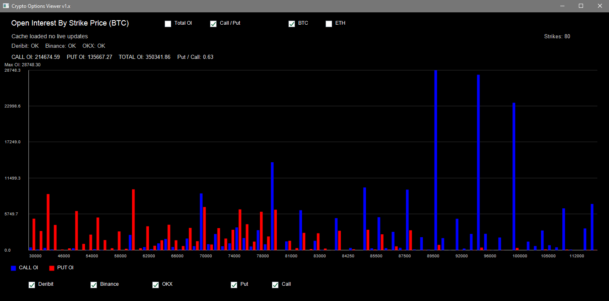

# Crypto Options Open Interest Viewer


Windows desktop application written in native C++ using the Win32 API and GDI+ for real-time visualization. The application aggregates, processes, and visualizes Open Interest (OI) data for Bitcoin and Ethereum options across major cryptocurrency derivatives exchanges.

## Features

Multi-Exchange Aggregation: Asynchronously fetches live market data from Deribit, Binance, and OKX via public HTTP REST APIs.

Asynchronous Multi-Threaded Architecture: Network requests and JSON parsing are executed in parallel background threads (std::thread), ensuring a responsive UI thread during data synchronization.

Thread-Safe Data Processing: Centralized memory cache protected by mutually exclusive locks (std::mutex) to prevent race conditions during updates.

Dynamic Visualization Components:
- Asset selection (BTC / ETH).
- Visualization mode switching (Combined Total OI / Separate Call-Put distribution).
- Granular data filtering by exchange source and option type (Call / Put).

Analytical Metrics: Real-time computation of aggregate volumes, total option types volume, and the Put/Call Ratio.

## Architecture and Implementation Details

Networking Layer: Implemented via native Windows Internet API (WinINet). Custom wrapper handles SSL/TLS connection termination, custom User-Agent specification, and sequential byte buffering (InternetReadFile).

Data Parsing Engine: Utilizes nlohmann/json for schema validation and extraction.
- Deribit Parser: Decodes instrument names to extract expiration tokens, strike prices, and raw open interest values.
- Binance Parser: Sequentially queries market definitions (/v1/exchangeInfo) to resolve active expirations before gathering specific metrics (/v1/openInterest).
- OKX Parser: Cross-references underlying instrument definitions (instruments?instType=OPTION) with current open interest states (open-interest).

Graphics and UI: Custom-drawn interface utilizing GDI+ graphics context. Layout calculations dynamically scale based on client window dimensions (WM_SIZE). Double-buffering logic handles complex chart updates to avoid visual artifacts.

## Prerequisites and Compilation

### Dependencies
Windows SDK (Win32 API, GDI+, WinINet).
C++17 compliant compiler (MSVC recommended).
nlohmann/json header-only library (json.hpp).

### Build Instructions
1. Open the project in Visual Studio.
2. Ensure json.hpp is present in your include paths.
3. The necessary system libraries are linked automatically via compiler directives:
```text
   #pragma comment(lib, "Gdiplus.lib")
   #pragma comment(lib, "Wininet.lib")
``` 
6. Set the build configuration to Release and architecture to x64.
7. Compile the solution (Ctrl + Shift + B).
8. The compiled ready-to-run executable binary (.exe file) will be generated and located in the project root output directory:
   \x64\Release\WindowsProject1.exe

## Screenshot


## Download
Pre-compiled executable binary for Windows is available for direct deployment:
[Download Crypto Options Viewer v1.x](https://github.com/AlexeyLong/Crypto-Options-Viewer-v1.x/blob/main/CryptoOptionsViewer_v1.x.exe)

## Disclaimer
This software is intended strictly for informational and educational purposes. It does not constitute financial or investment advice.
